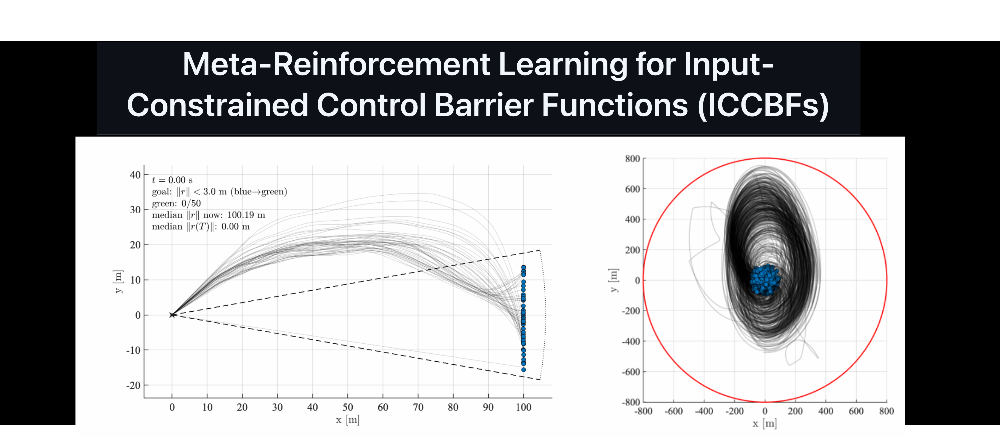
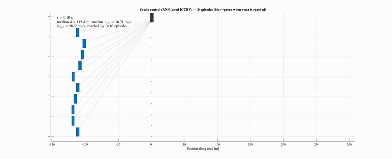
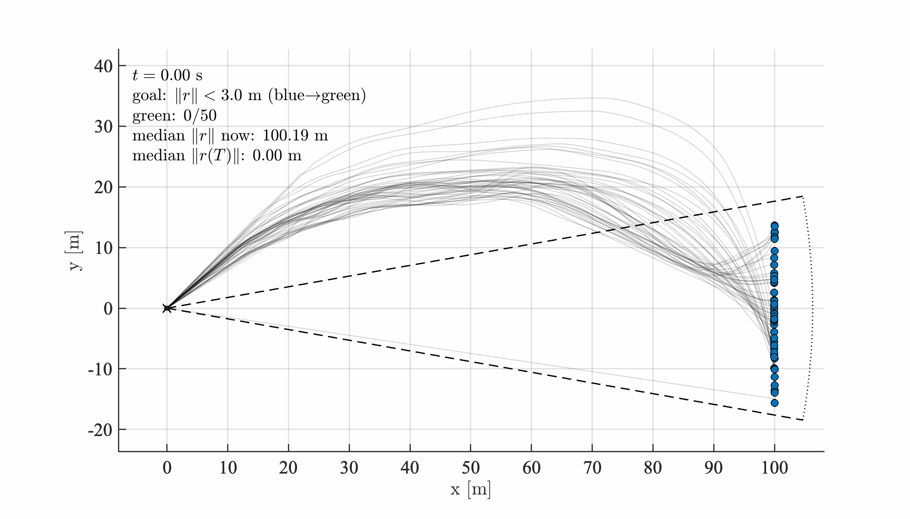

<p align="center">
  
</p>

<p align="center">
  <b>Robust & fuel-efficient autonomy for spacecraft proximity operations</b>
</p>

<p align="center">
  
  
  
</p>

---

## Overview

This repository contains the reference implementation for **Meta-Reinforcement Learning–aided Input-Constrained Control Barrier Functions (ICCBFs)** applied to **safety-critical spacecraft proximity operations**, including:

- Cruise control for a chaser car following a constant speed target
- Approaching and docking with a rotating spacecraft
- Completing an on-orbit inspection task with keep-out, keep-in, and illumination constraints

The framework combines:
- **Empirical, input-aware safety guarantees** via ICCBFs  
- **Long-horizon performance awareness** via meta-learned class-𝒦 parameters  
- **Expansion of the viability kernel beyond conservative invariant sets** 
- - **Robustness to hidden parameters and noise** accomplished by using recurrent neural networks

The result is **non-greedy, fuel-efficient, robust, and safe autonomy** for realistic rendezvous and proximity operation missions.

---

## 🎥 Demos (Real rollouts)

### Cruise Control (Input-constrained safety)



---

### Docking & Final Approach



---

### Autonomous Inspection (KOZ, KIZ, Sun constraints)

This is my favourite test case. The first result has no ICCBF tuning and achieves the inspection score very fast, but at a high fuel cost. The second one shows ICCBF tuning with MLP, which is not very successful. It lowers fuel consumption at the cost of an inspection score. The last one is where ICCBF is tuned by RNN Here, the RNN is able to both lower the fuel consumption while still satisfying full inspection 75% of the time. The inspection takes longer, of course, compared to the first case, but it reaches completion. This defines a nongreedy control barrier system.


*Figure: ICCBF inspection trajectories where only the nominal control is determined by RL. No ICCBF tuning. Cyan indicates task completion; blue indicates in-progress inspection.*


*Figure: NN-tuned ICCBF inspection trajectories. Cyan indicates task completion; blue indicates in-progress inspection.*


*Figure: RNN-tuned ICCBF inspection trajectories. Cyan indicates task completion; blue indicates in-progress inspection.*


---

## Installation

### Prerequisites

- Python 3.11 or 3.12
- [uv](https://docs.astral.sh/uv/getting-started/installation/) package manager
- NVIDIA GPU with CUDA 12.8 toolkit (for mamba-ssm / CUDA extensions)
- `swig` (for box2d-py): `sudo apt install swig`

### Setup

```bash
# Clone the repository
git clone https://github.com/<your-username>/MetaRL_for_ICCBFs.git
cd MetaRL_for_ICCBFs

# Install dependencies
uv sync

# (Optional) Install gymnasium rendering extras (pygame, box2d)
uv sync --extra envs

# (Optional) Install dev tools (pytest, ruff)
uv sync --extra dev
```

### CUDA extensions (mamba-ssm)

If mamba-ssm needs to build from source (no precompiled wheel available), set `CUDA_HOME` to your CUDA 12.8 toolkit:

```bash
CUDA_HOME=/usr/local/cuda-12.8 uv sync
```

### Verify installation

```bash
uv run python -c "import metarl_iccbf; import mamba_ssm; import torch; print('All good')"
```

---

## Key Contributions

- **Meta-RL tuning of ICCBF decay parameters**
  - Learns state-dependent class-𝒦 functions

- **Recoverability beyond conservative invariant sets**
  - Enables safe task completion from a subset of traditionally abandoned states

- **Fuel-aware autonomy**
  - Orders-of-magnitude reduction in total Δv for inspection and docking tasks

- **Inspection-aware safety**
  - Simultaneous handling of KOZ, KIZ, and Sun-angle constraints

---

## Representative Results

- Strong reduction in median and tail Δv consumption
- High rate of inspection completion rates for learned ICCBFs, with lower fuel consumption
- Improved robustness compared to untuned ICCBF and naive RL baselines

(See `src/inspection/plot_inspection_results_with_violin.py` for evaluation scripts.)

---

## 🗂 Repository Structure

```text
src/
 ├─ data/              # All .mat files and initial state sets stored here
 ├─ cruise_control/     # Cruise control experiments
 ├─ docking/            # Docking & final approach
 └─ inspection/         # Inspection task + evaluation
Notebooks/
 ├─ TrainedModels  # stores trainedmodels from the notebooks
 ├─ cruise_control.ipynb  # cruise control problem 
 ├─ docking.ipynb  #docking problem 
 ├─ inspection.ipynb #inspection problem
 ├─ images #plots used in the jupyter notebooks
media/
 ├─ cruise_control.mp4
 ├─ docking.mp4
 └─ inspection.mp4
