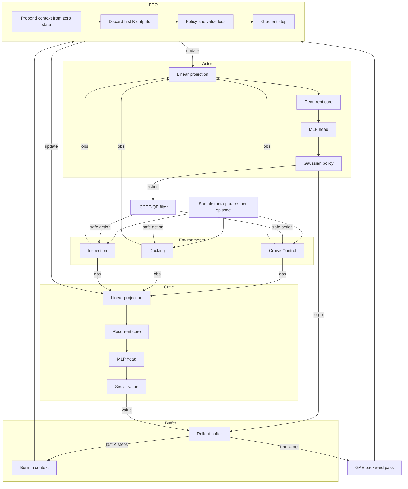

```mermaid
graph TD
    META[Sample meta-params per episode]

    subgraph Environments
        CC[Cruise Control]
        DK[Docking]
        INS[Inspection]
    end

    subgraph Actor
        AP[Linear projection]
        AR[Recurrent core]
        AM[MLP head]
        AOUT[Gaussian policy]
        AP --> AR --> AM --> AOUT
    end

    subgraph Critic
        CP[Linear projection]
        CR[Recurrent core]
        CM[MLP head]
        COUT[Scalar value]
        CP --> CR --> CM --> COUT
    end

    QP[ICCBF-QP filter]

    subgraph Buffer
        BUF[Rollout buffer]
        CTX[Burn-in context]
    end

    GAE[GAE backward pass]

    subgraph PPO
        SPLIT[Prepend context from zero state]
        DISCARD[Discard first K outputs]
        LOSS[Policy and value loss]
        GRAD[Gradient step]
        SPLIT --> DISCARD --> LOSS --> GRAD
    end

    META --> CC
    META --> DK
    META --> INS
    CC -->|obs| AP
    DK -->|obs| AP
    INS -->|obs| AP
    CC -->|obs| CP
    DK -->|obs| CP
    INS -->|obs| CP
    AOUT -->|action| QP
    QP -->|safe action| CC
    QP -->|safe action| DK
    QP -->|safe action| INS
    BUF -->|last K steps| CTX
    BUF -->|transitions| GAE
    AOUT -->|log-pi| BUF
    COUT -->|value| BUF
    GAE --> PPO
    CTX --> PPO
    PPO -->|update| AP
    PPO -->|update| CP
```
